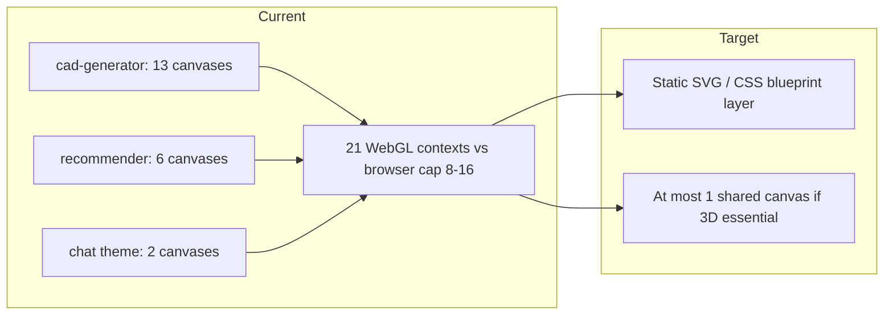

# SteelSmart Improvement Roadmap

> **Handoff document** for continuing work on SteelSmart (FYP). Created from planning session, Sep 2026.
>
> **Status:** Planning complete — **not implemented**. All phase todos are pending unless noted below.
>
> **How to use:** Read this file first, then follow phases in order. Run `npm test` after each phase. Read matching skills under `C:\Users\spoop\.codex\skills` per [`.cursor/rules/skills-and-codegraph.mdc`](../.cursor/rules/skills-and-codegraph.mdc).

---

## Quick context for the next agent

### What SteelSmart is

Next.js 16 / React 19 industrial steel-parts app (~263 TS files): catalogue, CAD generator (prompt → STEP via KittyCAD/Zoo), CAD analyzer (upload → specs → product match), product recommender, RFQ, admin reports. Backend: Supabase Postgres + Upstash Redis. LLMs: OpenRouter (drawing analysis), Gemini (multiview), KittyCAD (generation).

### Architecture pattern

`src/app/api/*/route.ts` → `src/services/*.service.ts` → `src/repositories/*.repository.ts` → Supabase. Some routes bypass services and call `src/lib/*` directly (notably recommendations).

### Already done (environment, not product code)

- **CodeGraph** indexed: 311 files, 2,915 nodes, 6,262 edges. MCP fixed in `C:\Users\spoop\.cursor\mcp.json` (use `codegraph_explore` with `projectPath` = repo root).
- **Skills** installed at `C:\Users\spoop\.codex\skills` (impeccable, motion-dev, caveman, cast, emil-design-eng, etc.).
- **Cursor rule** [`.cursor/rules/skills-and-codegraph.mdc`](../.cursor/rules/skills-and-codegraph.mdc) routes tasks to skills.

### User priorities (original order)

1. UI refinement — less AI slop, professional, smoother, better colour profile
2. 3D performance / crash fixes
3. Exa / Firecrawl for crawling/search
4. Analytics + recommendations (Databricks was considered; **replaced with Postgres-first**)
5. Voice input for CAD generator prompt

### Locked decisions

- **UI scope:** Refinement only — keep identity and copy; fix tokens, unify palette, remove slop. No full visual-world replacement.
- **Databricks:** Skip for now. Use Postgres SQL aggregation, pgvector, interaction tracking, and full-text search already in schema.

---

## Implementation checklist

Copy and tick as you go:

```
Phase 0 — Foundation
- [ ] 0a: Consolidate design tokens (globals.css + tailwind.config.js); define missing shadcn tokens (card, muted, destructive, ring, input); decide dark mode
- [ ] 0b: Replace 21 decorative WebGL canvases with static SVG/CSS blueprint layer (or one shared canvas)

Phase 1 — UI refinement
- [ ] Consolidate 14-family palette → one neutral + one brand accent + semantic status
- [ ] Remove slop: glass system, gradients, gradient text, oversized radii, shadow stacking, emoji in UI
- [ ] Typography: mono + tabular numerals; explicit type scale
- [ ] Motion: remove infinite decorative loops; useReducedMotion on Framer Motion files
- [ ] A11y: aria-labels on icon buttons; keyboard Header dropdown

Phase 2 — 3D stability
- [ ] webglcontextlost handlers; local error boundaries around 3D islands
- [ ] Fix CADPreview3D color-change full scene rebuild
- [ ] Lazy-load viewer in CADAnalyzer; remove 2.5s artificial delay
- [ ] Cap 12 PNG dataURL view payload; adaptive mesh deflection; drop duplicate ArrayBuffer; fix glTF spread overflow; fix GeneratedDrawingDisplay Date.now key

Phase 4 — Analytics + recommendations (do before Phase 3)
- [ ] 4a: SQL aggregation for reports/audit/RFQ; paginate admin findAll
- [ ] 4b: Regenerate Supabase types; re-enable interaction tracking + CF RPCs
- [ ] 4c: Wire product_embeddings + search_vector into product-matcher; fix RecommendationService stub drift

Phase 3 — Exa / Firecrawl
- [ ] external-catalog.service.ts; cache in Supabase; ground alternative-product-suggester; provenance in UI

Phase 5 — Voice input
- [ ] useSpeechInput hook; mic on TextInputPanel paperclip slot; Gemini audio + taxonomy bias; fix label + 500/1000 char mismatch
```

---

## Codebase findings (reference)

### UI / design

| Issue | Detail |
|-------|--------|
| Dual token systems | `tailwind.config.js` primary `#0066CC` vs `globals.css` `--color-primary: #2563eb` |
| Broken shadcn tokens | `bg-card`, `text-muted-foreground`, `ring-ring`, etc. undefined — see `src/components/ui/card.tsx` |
| Colour sprawl | ~14 Tailwind colour families; gray 1,025 uses vs scattered feature colours |
| Slop patterns | 1,078-line `globals.css` glass system; ~83 gradients; emoji in ProductRecommender, CADHistory, RFQ, chatbot flow |
| Motion | 8 Framer Motion files; infinite decorative loops; only AnimatedTextPrompt respects reduced motion |
| Dead code | Unused `HeroLight.tsx`; `puppeteer` in package.json unused |

### 3D / CAD

| Issue | Severity | Location |
|-------|----------|----------|
| 21 decorative WebGL contexts | Critical | `cad-generator/page.tsx` (13), `ProductRecommenderBlueprintLayer` (6), `ChatThemeBackground` (2) |
| No context-loss handling | High | All Canvas / WebGLRenderer |
| No 3D error boundaries | High | Only root ErrorBoundary in providers |
| Analysis triple load | High | Parse + live preview + 12 offscreen PNGs in CADAnalyzer |
| Scene rebuild on color change | Medium | CADPreview3D useEffect deps |
| Fixed OC deflection 0.1 | Medium | cad-parser.ts |
| Hero rotator | OK | PNG + SVG both exist in `public/model-frames/brake-rotor/` |

### Data / recommendations

| Built but off | Location |
|---------------|----------|
| `product_embeddings vector(768)` | Migration only — no app code |
| `search_vector` GIN index | Matcher uses `ilike` instead |
| `user_product_interactions` + CF RPCs | Writes commented out in interaction-tracking.service.ts |
| JS aggregation | report.repository getStatistics, audit-report, rfq-report, admin dashboard full catalog load |

### Voice input target

- **Not** the chatbot (`SteelbotAssistant` disabled in providers; button-only scripted flow).
- **Yes** CAD generator `TextInputPanel.tsx` — paperclip button lines ~203–209 has no onClick; state in `CADGenerator.tsx` `textInput`.

---

## Phase 0 — Foundation (serves UI + 3D)

### 0a. One source of truth for design tokens

Today two systems disagree. [`tailwind.config.js`](../tailwind.config.js) defines `primary: '#0066CC'`, purple `secondary`, cyan `accent`; [`src/app/globals.css`](../src/app/globals.css) defines `--color-primary: #2563eb`, slate secondary, amber accent.

Worse, shadcn-style primitives reference tokens that **do not exist**:

```tsx
// src/components/ui/card.tsx
<div className={cn("rounded-lg border bg-card text-card-foreground shadow-sm", className)} />
```

`bg-card`, `text-card-foreground`, `text-muted-foreground`, `ring-ring`, `bg-destructive`, `border-input` are all undefined.

**Actions:**

- Declare CSS variables in `globals.css` `:root` as single source; map in `tailwind.config.js` via `hsl(var(--...))`.
- Add semantic tokens: `card`, `card-foreground`, `muted`, `muted-foreground`, `destructive`, `destructive-foreground`, `ring`, `input`, `popover`, `foreground`.
- Delete duplicate/conflicting values — one primary, one accent.
- Decide dark mode: configure `darkMode: 'class'` or strip ~33 dead `dark:` classes in PerformanceMetricsDashboard.

### 0b. Collapse decorative 3D

[`src/app/cad-generator/page.tsx`](../src/app/cad-generator/page.tsx) mounts **13** `BlueprintModel3D` instances; each creates its own WebGL `<Canvas>` with `preserveDrawingBuffer: true`.



**Recommended:** Replace decorative instances with static SVG/CSS blueprint layer (`public/model-frames/brake-rotor/*.svg` already exist). Removes crash class and loudest slop signal.

If live 3D must stay: **one** `<Canvas>`, instanced meshes, `dpr={[1, 1.5]}`, `frameloop="demand"`, drop `preserveDrawingBuffer`.

Also: [`ProductRecommenderBlueprintLayer.tsx`](../src/components/cad/ProductRecommenderBlueprintLayer.tsx), [`ChatThemeBackground.tsx`](../src/components/chatbot/ChatThemeBackground.tsx).

---

## Phase 1 — UI refinement

### Palette

- One neutral ramp (gray **or** slate), one brand blue, semantic red/amber/green only.
- Demote feature colours to icon level (analyzer green, recommender purple).
- Rework [`src/components/ui/badge.tsx`](../src/components/ui/badge.tsx) rainbow variants.

### Slop removal

- Glass system in `globals.css` → solid surfaces + 1px border. Heavy: CatalogContent, ChatPanel.
- ~83 gradients → keep at most hero; remove gradient text (`bg-clip-text`).
- Normalise `rounded-2xl` / `rounded-3xl` / `rounded-[32px]` → 4–6px scale.
- Replace shadow stacking with borders + one elevation.
- Remove emoji from ProductRecommender, CADHistorySection, RFQTracking, chatbot-flow sections → Lucide.
- Delete unused HeroLight.tsx and puppeteer dependency.

### Typography

- Add mono font with tabular numerals for dimensions/SKUs.
- Explicit type scale vs ad-hoc `text-xs`–`text-8xl`.

### Motion

- Remove infinite decorative motion (chat bob, theme pulse, catalog animate-pulse overlay).
- Reserve motion for state transitions.
- `useReducedMotion` guard on all 8 Framer Motion files.

### Accessibility

- `aria-label` on icon buttons: Header mobile menu, Modal close, Toast dismiss, AdminLayout sidebar, login password toggle.
- Header "AI CAD Tools" dropdown: keyboard operable (currently hover-only).

**Skills:** `impeccable` (run `impeccable.cmd context` on Windows first), `emil-design-eng` for motion review, `craft-floor.md` before UI edits.

---

## Phase 2 — 3D stability hardening

Applies to [`CADPreview3D.tsx`](../src/components/cad/CADPreview3D.tsx) and [`CADAnalyzer.tsx`](../src/components/cad/CADAnalyzer.tsx).

- `webglcontextlost` / `webglcontextrestored` handlers
- Local error boundary per 3D island
- Remove `modelColor` / `wireframeColor` from scene useEffect deps (CADPreview3D)
- Lazy-load viewer in CADAnalyzer (currently static import)
- Remove hardcoded `setTimeout(2500)` in analyze path
- Cap/defer 12× 800×600 base64 PNG views in state
- Adaptive OpenCascade mesh deflection in [`cad-parser.ts`](../src/lib/cad-parser.ts) (fixed 0.1 today)
- Drop `_internalShapeData` duplicate ArrayBuffer
- Fix glTF `Math.min(...filter())` stack overflow on large meshes
- Remove `key={Date.now()}` remount in GeneratedDrawingDisplay

**Skills:** `threejs-r3f`, `surgical-patch`.

---

## Phase 3 — Exa / Firecrawl grounding

Zero crawling today. [`alternative-product-suggester.ts`](../src/lib/alternative-product-suggester.ts) LLM name-drops suppliers without real data.

| Tool | Role |
|------|------|
| **Exa** | Request-time semantic discovery (URLs + snippets) |
| **Firecrawl** | Scheduled structured spec extraction from supplier pages |

**Implementation:**

- `src/services/external-catalog.service.ts` (service → repository pattern)
- Normalise via `component_taxonomy`, `material_synonyms`
- Cache in Supabase with TTL — not per-request crawl
- UI: mark retrieved vs inferred suggestions
- Keep AISC/ASME/ISO static fallbacks

**Needs:** Exa and/or Firecrawl API keys in env.

**Skills:** Firecrawl skills in Cursor plugins if using CLI.

**Do Phase 4 before Phase 3** (both touch matcher / suggester).

---

## Phase 4 — Analytics + recommendations (Databricks replacement)

### 4a. SQL aggregation

Example bottleneck — [`report.repository.ts`](../src/repositories/admin/report.repository.ts) `getStatistics()` fetches all `status` rows and counts in JS.

- Replace with `COUNT(*) ... GROUP BY status` (RPC or view)
- Same for audit-report.service, rfq-report.service
- Paginate admin product.repository `findAll` (dashboard loads full catalog to count stock)

### 4b. Re-enable interaction tracking

[`interaction-tracking.service.ts`](../src/services/interaction-tracking.service.ts) returns early — table + RPCs exist in migrations:

- Regenerate `src/lib/database.types.ts`
- Uncomment client/server writes
- Collaborative filtering RPCs start returning real data

### 4c. Hybrid recommender

- Wire `product_embeddings vector(768)` — embedding generation + similarity path in [`product-matcher.ts`](../src/lib/product-matcher.ts)
- Use `search_vector` via `textSearch` instead of `ilike`
- Consolidate RecommendationService stubs; routes currently bypass service

**Skills:** `migration` for schema/type transitions, `lean-build` for feature slices.

---

## Phase 5 — Voice input (CAD generator)

**Target:** [`TextInputPanel.tsx`](../src/components/cad/generator/TextInputPanel.tsx) — not chatbot.

- Mic button: replace/enhance paperclip at ~lines 203–209
- Transcript → `onTextInputChange` → `CADGenerator` `textInput` state
- **Gemini audio** transcription (not Web Speech) — bias with `component_taxonomy` + `material_synonyms`
- Hook: `src/hooks/useSpeechInput.ts` → `{ isListening, transcript, start, stop, error }`
- Fix: missing `<label>` on textarea; UI shows 500 chars, server allows 1000

**Skills:** `lean-build`, `motion-dev` for mic UI feedback.

---

## Sequencing

1. **Phase 0** first (blocks 1 + 2)
2. **Phase 1** and **Phase 2** after 0
3. **Phase 4** before **Phase 3** (shared matcher/suggester)
4. **Phase 5** independent — can ship early for demo
5. Run **`npm test`** after each phase (~30 Vitest UC files)

---

## Key file index

| Area | Files |
|------|-------|
| Tokens | `tailwind.config.js`, `src/app/globals.css`, `src/components/ui/*` |
| Decorative 3D | `src/app/cad-generator/page.tsx`, `src/components/cad/BlueprintModel3D.tsx`, `ProductRecommenderBlueprintLayer.tsx` |
| Real 3D | `CADPreview3D.tsx`, `CADAnalyzer.tsx`, `src/lib/cad-parser.ts`, `cad-view-generator.ts` |
| Recommendations | `src/lib/product-matcher.ts`, `alternative-product-suggester.ts`, `src/services/recommendation.service.ts` |
| Analytics | `src/repositories/admin/report.repository.ts`, `src/services/admin/audit/*`, `src/services/admin/rfq/*` |
| Voice | `src/components/cad/generator/TextInputPanel.tsx`, `CADGenerator.tsx`, `src/services/cad-generation.service.ts` |
| API surface | `src/app/api/**/route.ts` (32 routes) |
| Schema | `supabase/migrations/*`, `src/lib/database.types.ts` |

---

## External services & env vars

| Service | Env | Used for |
|---------|-----|----------|
| Supabase | `NEXT_PUBLIC_SUPABASE_URL`, `NEXT_PUBLIC_SUPABASE_ANON_KEY`, `SUPABASE_SERVICE_ROLE_KEY` | DB, auth, storage |
| Upstash Redis | `UPSTASH_REDIS_REST_URL`, `UPSTASH_REDIS_REST_TOKEN` | Server cache |
| OpenRouter | `OPENROUTER_API_KEY` | Drawing analysis, alternatives |
| Gemini | `GEMINI_API_KEY` | Multiview analysis; candidate for voice |
| KittyCAD/Zoo | `ZOO_API_TOKEN` | CAD generation |

---

## Related docs in repo

- [`documentation/Architecture/ARCHITECTURE_REVIEW.md`](Architecture/ARCHITECTURE_REVIEW.md)
- [`src/lib/cache/CACHE_INVALIDATION.md`](../src/lib/cache/CACHE_INVALIDATION.md)
- Migration guides under `documentation/State Management & Caching/`

---

*Last updated: planning session handoff. Do not treat Cursor plan UUID files as source of truth — this file is the canonical roadmap in the repo.*
